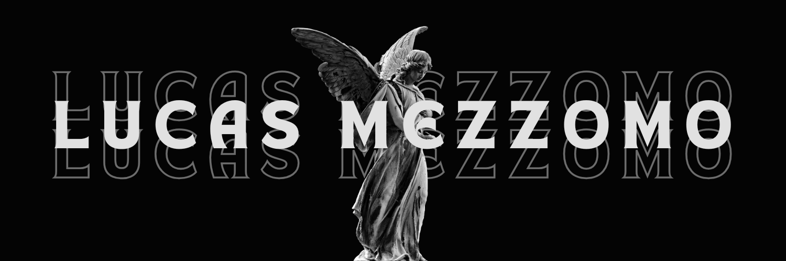

  

  # Olá, eu sou o Lucas Mezzomo! 👋

  ### 🚀 Estudante de Engenharia de Software | Full Stack Developer

  Transformando código em soluções que geram valor. Tenho foco em criar aplicações que resolvem problemas reais, com experiência prática que vai desde a concepção da interface até a estruturação de bancos de dados robustos.

  Atualmente, dedico meu tempo aos estudos de tecnologias modernas, à faculdade de Engenharia de Software e à criação de sites e webapps, integrando o poder da Inteligência Artificial para otimizar o desenvolvimento e a entrega de resultados.

  ---

  ### 🛠️ Hard Skills

  #### **Fundamentos & Estrutura**
       

  #### **Frameworks, Bibliotecas & Agilidade**
        

  #### **Dados & Persistência**
    

  ---

  ### 🧠 Soft Skills
  🧩 Resolução de Problemas • 📢 Comunicação • 📅 Organização • 📚 Aprendizado Contínuo

  ---

  ### 📫 Contato
  Se você busca um desenvolvedor focado em tecnologias de ponta e soluções modernas, entre em contato:

  
  

